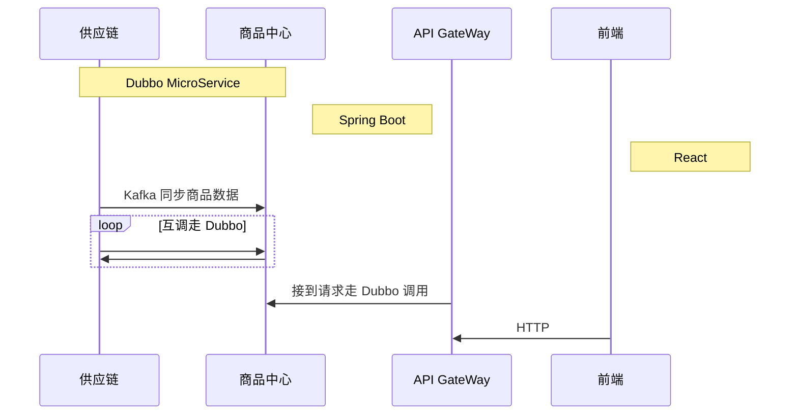

# 自动化造商品工具

### 背景

之前在一个做养车业务的部门，当时在的是商城的业务线上，这个业务线简单来说就是展示一个商城页面，让用户在这个页面上购买商品或者服务，比如购买轮胎，雨刷。购买洗车服务等等

所以测试面临的一个问题就是商品数据，这个在测试环境上是需要测试自己来构造的。所以需要做一个造数工具来帮助测试快速的构造商品

### 结构分析

创建商品并展示，涉及的链条比较长，从供应链到商品中心再到管理后台前端去做定价，上架等处理，所以大概的逻辑结构就是

这样的话，我的工具需要同时具备以下功能

- [x] HTTP 请求
- [x] 调用 Dubbo
- [x] 查询数据库

其他的都好说，Dubbo的话只能用Spring了