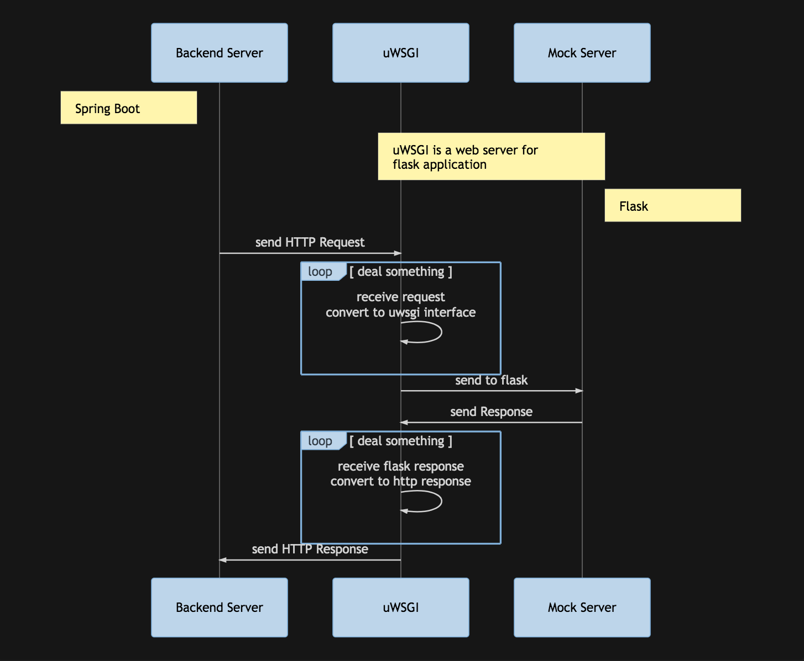

# 浅谈基础知识是否有用

### 背景

为什么会写这个帖子呢？起源比较简单，中午吃完饭和同事在外边散步的时候，聊到现在面试的奇葩问题的时候，同事幽幽的提出一个问题，了解这么多基础的知识，工作中真的有帮助吗

### 下个定义

所谓的基础知识，指的是类似于 TCP 三次握手、HTTP/HTTPS 通信过程、算法/红黑树/动态规划 等等这些比较基础而且平时做业务测试，写业务代码时一般用不到的东西


### 我的例子

当时我想了一下，决定先说结论：
- 做业务，写一堆 CURD 的代码的时候基本用不到，会和不会并不能有太多明显差别
- 基础知识在一些特殊情况下很有用，甚至能决定很多事情的结果

逐一解释，因为在大部分时候，无论是测试还是开发，都是在做公司业务层面的事情，所以我们写的代码，测试的实施，其实是在做 `工程`。这个时候，写代码就变成了一门手艺，他是属于 `技术` 范畴的。其实大家都知道，技术这个东西跟熟练度有关系，一般会遵从一万小时定律(**虽然说这个定律的人原话并不是这个意思**)。而且做工程的时候，你的一些架构的能力，宏观的规划能力，多人协作的能力更重要，比如互联网行业对数据库说烂了的一些原则 `分库分表` `读写分离` ，比如写出来的代码更容易被其他人读懂，不要重复造轮子 等等。

这些东西其实跟基础知识没什么必然联系，更多的还是你对 `工程` 的认知，项目做多了之后的经验的积累，一些细节的处理


但是为什么基础知识还是很有用的呢，我用了一个自身的例子来说明这个问题

背景是我在一家做互金小贷业务的公司当测试的时候，当时监管部门有一个要求，要求我们的系统比如接入一个认证公司，那个认证公司给我们的接口文档非常的不清楚，解答我们的疑问非常缓慢，然而监管对我们接入的时间有死线，不能接入就只能下架。

所以当时我们周六日的时候来加班搞这个事情，当然你懂的，周六的时候对接的公司肯定是不上班的，没人解答问题

而且当时对接的公司他们的测试环境的安全认证有一项是限制调用方 IP 的，然而我们的测试环境机器的 IP 给出去的好像不对，导致测试环境不能访问他们的接口

所以当时的解决方案是，根据他们提供的接口文档(虽然文档写的大部分根本看不懂) 我在我做的 Mock Server 上加上他们的接口，然后让我们的后端服务来访问 Mock Server 进行测试

当时的架构是

<!-- ```mermaid
    sequenceDiagram
        participant Backend Server
        participant uWSGI
        participant Mock Server

        note left of Backend Server: Spring Boot
        note over uWSGI,Mock Server: uWSGI is a web server for<br>flask application
        note right of Mock Server: Flask

        Backend Server->>uWSGI: send HTTP Request
        loop deal something
            uWSGI->>uWSGI: receive request<br>convert to uwsgi interface
        end
        uWSGI->>Mock Server: send to flask
        Mock Server->>uWSGI: send Response
        loop deal something
           uWSGI->>uWSGI: receive flask response<br>convert to http response
        end 
        uWSGI->>Backend Server: send HTTP Response
``` -->


至于为什么要搞一个 uWSGI 放在中间，这个放到说 Flask 的帖子再说，顺便吐槽一下很多测试写 Flask 都是直接启动，而不是用 uWSGI 或者别的什么来启动

当时 uWSGI 和 Flask 的 Mock Server 放在另一台机器上，测试环境的后端部署在 AWS 上，我的 Mock 也是，只不过不是同一台机器，但是它们走的是内网

刚开始没什么问题，测试用起来美滋滋

但是很快，发现在一个地方会出现 HTTP 请求报错，而这个请求距离上一条请求间隔很短且上一条请求没有报错，而且报错信息非常诡异，只有一行 `failed response`(~~我记得是这个~~)

既然毫无头绪，那我做一个大胆的猜想，uWSGI 有bug，所以我去掉 uWSGI 直接用 Flask 框架自带的 Web Server 启动

**问题消失了！！**

当时我整个人都不好了，难道人品这么差，随便搞搞都能碰到 uWSGI 的bug？

没办法，只好求助于 CTO

CTO 解决问题的思路非常清晰，抓包 -> 分析包

好的，tcpdump 走起

抓下来pcap包用 CTO 最爱的 Wireshark 打开分析

首先 TCP 的握手包 SYN ACK 没看出来有啥问题(~~我才不会说我从来看不出来有啥问题~~)

然后重点的 HTTP 的包

我也没看出来有啥问题 ~~摔桌~~

还得 CTO 亲自看，大概看了一下，也没看到什么

于是 CTO 看了一下 tcpdump 抓包时打印出来的数据

看到了 R(**reset**) 标志位出现

于是再对照着 Wireshark 解析的详细 HTTP 的包来看发现了问题

原来是后端服务使用的 HttpClient 在发请求的时候默认使用 http1.1 ，要求 keep-alive，然而 uWSGI 默认没有开启支持，所以会返回告诉客户端不行

然而由于种种原因，这个返回包还没到达客户端，客户端就发起了第二条请求，因为用了 keep-alive 所以会直接复用上一条链路，但是 uWSGI 已经因为不支持而关闭了

这就是出现这种诡异的问题的原因

特别是好巧不巧的事，开发对 HttpClient 的封装中，只打印了简单的报错信息，所以这个请求失败的时候只打印了上文中的那种奇怪的内容，增加了判断的不易

而且 HttpClient 的 NetworkManager 默认的重试机制是只有发送请求时失败才重试，这个案例发送请求是成功的，所以也不会触发重试机制

写了这么多，想说明的是，对于基础知识的掌握在遇到一些问题的时候，能定位问题，解决问题是很关键的

而这也是让你脱颖而出比别人贵的原因

顺便吐槽下 GitHub Pages 竟然不支持 mermaid 害得我画个时序图还得截图然后使用

[回到目录](README.md)